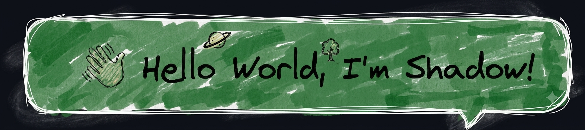

  

<h1 align="center">NameOfShadow</h1>

  <strong>Security Engineering • Systems Programming • Infrastructure</strong>

---

I'm Damir Anglickas, an Information Security student from Kaliningrad.  
I build performance-critical software, experiment with infrastructure, and explore cybersecurity through national competitions, homelabs, and open‑source development.

My competitive journey taught me to think on my feet — from **regional champion** in threat defense to a **silver medalist at the 2026 "Professionals" National Finals** — and gave me a hands‑on edge in Blue Team operations and detection engineering.

### Technologies

  

### GitHub Stats

  

### Current Focus

* Infrastructure & Enterprise Security (Blue Team)
* Application Security (AppSec) & DevSecOps
* Linux Internals & Network Protocols
* Asynchronous Systems Programming in Rust

### Featured Projects

| Project | Description |
| :---    | :---        |
| **[rust-mc-status](https://github.com/NameOfShadow/rust-mc-status)** | High‑performance async Minecraft server status client (Java & Bedrock) with builder API, response caching, proxy support, and Tower middleware — **3k+ downloads**. |
| **[lupa](https://github.com/NameOfShadow/lupa)** | Drop‑in `dbg!` replacement with a live web UI + TUI, snapshot diffing, and zero config — inspect Rust structs like a pro. |
| **[rfast](https://github.com/NameOfShadow/rfast)** | Run Rust files like scripts — instant SHA‑256 caching, inline dependencies, and zero boilerplate. Rust as a scripting language. |

### Connect with me

---

> Build it. Break it. Understand it.
